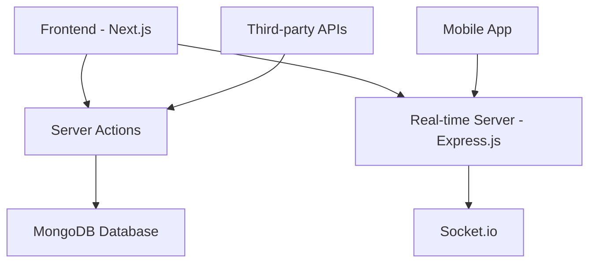

# 🚢 Avolship - Fulfillment Services Platform

<div align="center">
  
  
  
</div>

<div align="center">
  <h3>🌍 Multi-Country Logistics & Fulfillment Management System</h3>
  <p>A comprehensive platform designed for African markets, centralizing warehouse operations, order processing, inventory management, and customer communication across multiple countries.</p>
</div>

<div align="center">

[](https://www.typescriptlang.org/)
[](https://nextjs.org/)
[](https://www.mongodb.com/)
[](https://tailwindcss.com/)
[](LICENSE)

</div>

---

## 📋 Table of Contents

- [🌟 Features](#-features)
- [🏗️ System Architecture](#️-system-architecture)
- [🚀 Tech Stack](#-tech-stack)
- [📁 Project Structure](#-project-structure)
- [⚡ Quick Start](#-quick-start)
- [🔧 Installation](#-installation)
- [🌐 Environment Setup](#-environment-setup)
- [👥 User Roles](#-user-roles)
- [🎨 UI Components](#-ui-components)
- [🌍 Localization](#-localization)
- [📱 Mobile App](#-mobile-app)
- [🔒 Security](#-security)
- [🚢 Deployment](#-deployment)
- [🤝 Contributing](#-contributing)
- [📄 License](#-license)

---

## 🌟 Features

### Core Functionality
- **🏭 Multi-Warehouse Management** - Centralized inventory across multiple African countries
- **📦 Order Processing** - Automated order management with real-time tracking
- **💰 Financial Management** - Manual payment processing with comprehensive reporting
- **🔐 Role-Based Access Control** - Secure authentication with 2FA support
- **📊 Real-Time Analytics** - Advanced reporting and performance metrics
- **💬 Integrated Communication** - Chat system for seamless team collaboration

### Advanced Features
- **🌍 Multi-Country Operations** - Support for various African markets
- **📱 Mobile-First Design** - Responsive interface for all devices
- **🔔 Smart Notifications** - Real-time alerts for inventory, orders, and payments
- **📈 Performance Dashboards** - Comprehensive analytics for all user roles
- **🚚 Delivery Tracking** - Real-time location tracking for delivery personnel
- **🏆 Gamification** - Leaderboards for providers and delivery staff

---

## 🏗️ System Architecture



---

## 🚀 Tech Stack

### Frontend
- **Framework**: Next.js 14+ (App Router)
- **Language**: TypeScript
- **Styling**: TailwindCSS + Shadcn/ui
- **State Management**: React Server Components + Server Actions

### Backend
- **Runtime**: Node.js
- **Database**: MongoDB with Mongoose ODM
- **Real-time**: Express.js + Socket.io
- **Authentication**: Custom JWT + 2FA

### Development Tools
- **Package Manager**: npm/yarn
- **Code Quality**: ESLint + Prettier
- **Version Control**: Git + GitHub

---

## 📁 Project Structure

```
avolship/
├── src/
│   ├── app/                    # Next.js App Router
│   │   ├── (auth)/            # Authentication routes
│   │   ├── (dashboard)/       # Dashboard layouts
│   │   ├── api/               # API routes (minimal)
│   │   └── globals.css        # Global styles
│   ├── components/            # Reusable UI components
│   │   ├── ui/               # Shadcn/ui components
│   │   ├── forms/            # Form components
│   │   ├── dashboard/        # Dashboard-specific components
│   │   └── common/           # Common components
│   ├── lib/                  # Utility functions
│   │   ├── actions/          # Server actions
│   │   ├── auth/             # Authentication logic
│   │   ├── db/               # Database connection
│   │   ├── utils/            # Helper functions
│   │   └── validations/      # Zod schemas
│   ├── models/               # Mongoose models
│   ├── types/                # TypeScript type definitions
│   └── locales/              # Internationalization
│       ├── en.json
│       └── fr.json
├── server/                   # Express.js real-time server
│   ├── routes/
│   ├── middleware/
│   └── socket/
├── public/                   # Static assets
├── docs/                     # Documentation
└── mobile/                   # React Native mobile app (future)
```

---

## ⚡ Quick Start

### Prerequisites
- Node.js 18+
- MongoDB 6+
- npm or yarn

### Clone & Install
```bash
# Clone the repository
git clone https://github.com/yourusername/avolship.git
cd avolship

# Install dependencies
npm install

# Set up environment variables
cp .env.example .env.local

# Start development servers
npm run dev          # Next.js frontend
npm run server:dev   # Express.js real-time server
```

Visit `http://localhost:3000` to see the application.

---

## 🔧 Installation

### 1. Database Setup
```bash
# Install MongoDB locally or use MongoDB Atlas
# Create a new database: avolship_db
```

### 2. Environment Configuration
```env
# Database
MONGODB_URI=mongodb://localhost:27017/avolship_db

# Authentication
NEXTAUTH_SECRET=your-secret-key
JWT_SECRET=your-jwt-secret

# Real-time Server
REALTIME_SERVER_PORT=3001
SOCKET_IO_CORS_ORIGIN=http://localhost:3000

# Email (for notifications)
SMTP_HOST=your-smtp-host
SMTP_PORT=587
SMTP_USER=your-email
SMTP_PASS=your-password
```

### 3. Development Setup
```bash
# Install dependencies
npm install

# Run database migrations/seeds
npm run db:seed

# Start development
npm run dev
```

---

## 🌐 Environment Setup

### Development
```bash
npm run dev          # Start Next.js dev server
npm run server:dev   # Start Express.js server
npm run db:seed      # Seed database with sample data
```

### Production
```bash
npm run build        # Build Next.js application
npm run start        # Start production server
npm run server:prod  # Start production real-time server
```

---

## 👥 User Roles

| Role | Permissions | Dashboard Access |
|------|-------------|------------------|
| **👨‍💼 Admin** | Full system control, user management, payment processing | All dashboards |
| **🛒 Seller** | Product management, order tracking, inventory | Seller Dashboard |
| **🏢 Provider** | Service management, delivery tracking, leaderboards | Provider Dashboard |
| **🚚 Delivery** | Delivery management, route optimization, status updates | Delivery Dashboard |
| **📞 Call Center** | Order confirmation, customer verification | Call Center Dashboard |
| **🎧 Support** | Ticket management, customer queries | Support Dashboard |
| **📊 Moderator** | Reporting, analytics, billing tasks | Limited Admin Access |

---

## 🎨 UI Components

Built with **Shadcn/ui** and **TailwindCSS** using Avolship's brand colors:

### Color Palette
- **Primary**: `#1c2d51` (Deep Navy)
- **Secondary**: `#f37922` (Vibrant Orange)  
- **Accent**: `#e3e438` (Bright Yellow)

### Key Components
- Dashboard layouts with sidebar navigation
- Data tables with sorting and filtering
- Modern forms with validation
- Real-time notification system
- Interactive charts and analytics
- Mobile-responsive design

---

## 🌍 Localization

Supports **English** and **French** with dynamic language switching:

```typescript
// Example usage
import { useTranslation } from '@/lib/i18n';

const { t } = useTranslation();
return <h1>{t('common.dashboard')}</h1>;
```

### Adding Translations
1. Update `src/locales/en.json`
2. Update `src/locales/fr.json`
3. Use the translation key in components

---

## 📱 Mobile App

**🚧 In Development** - React Native mobile application for delivery personnel featuring:

- Real-time GPS tracking
- Route optimization
- Delivery status updates
- Push notifications
- Offline capability

---

## 🔒 Security

### Features
- **🔐 JWT Authentication** with refresh tokens
- **🛡️ Two-Factor Authentication** (2FA)
- **🔑 Role-Based Access Control** (RBAC)
- **🔒 Data Encryption** for sensitive information
- **🚨 Security Audit Logging** for critical operations
- **⏰ Session Management** with timeout notifications

### Best Practices
- Password hashing with bcrypt
- CORS configuration
- Rate limiting
- Input validation with Zod
- SQL injection prevention

---

## 🚢 Deployment

### Vercel (Recommended)
```bash
# Install Vercel CLI
npm i -g vercel

# Deploy
vercel

# Set environment variables in Vercel dashboard
```

### Traditional Hosting
```bash
# Build for production
npm run build

# Start production server
npm start
```

---


We welcome contributions! Please see our [Contributing Guidelines](CONTRIBUTING.md).

### Development Workflow
1. Fork the repository
2. Create a feature branch (`git checkout -b feature/amazing-feature`)
3. Commit changes (`git commit -m 'Add amazing feature'`)
4. Push to branch (`git push origin feature/amazing-feature`)
5. Open a Pull Request

### Code Standards
- Use TypeScript for all new code
- Follow ESLint and Prettier configurations
- Write tests for new features
- Update documentation as needed

---

## 📄 License

This project is licensed under the MIT License - see the [LICENSE](LICENSE) file for details.

---

<div align="center">

### 🚢 **Avolship** - Streamlining African Logistics

**Made with ❤️ for African businesses**

[](https://github.com/yourusername/avolship)
[](https://github.com/yourusername/avolship)

</div>