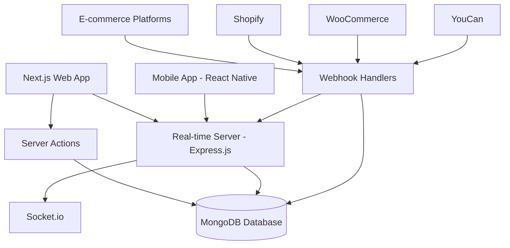

# 🚢 Avolship - Multi-Country Fulfillment & Logistics Platform

<div align="center">
  
  
  
</div>

<div align="center">
  <h3>🌍 Complete E-commerce Logistics Ecosystem for African Markets</h3>
  <p>A comprehensive multi-platform solution centralizing warehouse operations, order processing, delivery management, and real-time communication across multiple countries.</p>
</div>

<div align="center">

[](https://www.typescriptlang.org/)
[](https://nextjs.org/)
[](https://reactnative.dev/)
[](https://www.mongodb.com/)
[](https://socket.io/)
[](https://tailwindcss.com/)
[](LICENSE)

</div>

---

## 📋 Table of Contents

- [🌟 Overview](#-overview)
- [🏗️ System Architecture](#️-system-architecture)
- [🚀 Tech Stack](#-tech-stack)
- [✨ Features](#-features)
- [🔌 E-commerce Integrations](#-e-commerce-integrations)
- [📁 Project Structure](#-project-structure)
- [⚡ Quick Start](#-quick-start)
- [👥 User Roles](#-user-roles)
- [🎨 UI Components](#-ui-components)
- [🌍 Localization](#-localization)
- [🔒 Security](#-security)
- [📱 Mobile Application](#-mobile-application)
- [🔄 Real-time Features](#-real-time-features)
- [🚢 Deployment](#-deployment)
- [🤝 Contributing](#-contributing)
- [📄 License](#-license)

---

## 🌟 Overview

Avolship is a complete fulfillment and logistics management ecosystem specifically designed for African e-commerce markets. The platform consists of three integrated systems:

1. **Web Application** - Full-featured dashboard for all user roles
2. **Real-time Server** - WebSocket-based communication and webhook processing
3. **Mobile App** - Native delivery management for field operations

### Key Capabilities

- **Multi-warehouse inventory management** across different countries
- **Automated order processing** from multiple e-commerce platforms
- **Real-time delivery tracking** with GPS integration
- **Integrated payment verification** and financial reporting
- **Multi-language support** (English & French)
- **Role-based dashboards** for 7 different user types

---

## 🏗️ System Architecture



### Components

- **Frontend**: Next.js 15 with App Router, React Server Components
- **Real-time Server**: Express.js + Socket.io for live updates and webhooks
- **Mobile App**: React Native + Expo for delivery personnel
- **Database**: MongoDB with Mongoose ODM
- **Authentication**: JWT with 2FA support
- **File Storage**: AWS S3 / Cloudinary integration

---

## 🚀 Tech Stack

### Web Application (avolship/)

- **Framework**: Next.js 15+ (App Router)
- **Language**: TypeScript
- **UI**: TailwindCSS + Shadcn/ui components
- **Forms**: React Hook Form + Zod validation
- **State**: React Server Components + Server Actions
- **Auth**: NextAuth.js v4
- **Real-time**: Socket.io Client
- **Testing**: Vitest + Playwright

### Real-time Server (avolship-realtime-server/)

- **Runtime**: Node.js 20+
- **Framework**: Express.js 5
- **Real-time**: Socket.io
- **Database**: Mongoose ODM
- **Email**: Nodemailer with Handlebars templates
- **Storage**: AWS S3 SDK / Cloudinary
- **Auth**: JWT + bcryptjs
- **Testing**: Jest + Supertest
- **Logging**: Winston

### Mobile App (avolship-mobile-app/)

- **Framework**: React Native + Expo 53
- **Language**: TypeScript
- **Navigation**: Expo Router
- **UI**: NativeWind (Tailwind for React Native)
- **Maps**: Expo Maps + React Native Maps
- **Location**: Expo Location
- **Real-time**: Socket.io Client
- **Storage**: AsyncStorage

---

## ✨ Features

### Core Functionality

- **🏭 Multi-Warehouse Management** - Centralized inventory across African countries
- **📦 Order Processing** - Automated order management with status tracking
- **🚚 Delivery Management** - Route optimization and real-time GPS tracking
- **💰 Financial Management** - Manual payment verification with comprehensive reporting
- **📊 Analytics Dashboard** - Real-time performance metrics and insights
- **💬 Integrated Chat** - Team collaboration and customer support
- **🔔 Smart Notifications** - Real-time alerts for inventory, orders, and payments
- **📱 Mobile-First Design** - Responsive interface across all devices

### Advanced Features

- **🔄 E-commerce Sync** - Automatic order import from Shopify, WooCommerce, YouCan
- **🌍 Multi-Country Operations** - Support for various African markets
- **🏆 Gamification** - Leaderboards for providers and delivery staff
- **📈 Performance Tracking** - Delivery success rates and provider rankings
- **🎯 Route Optimization** - Smart delivery route planning
- **📸 Proof of Delivery** - Photo capture and signature collection
- **🔐 2FA Authentication** - Enhanced security for all users
- **📧 Email Automation** - Templated notifications for order events

---

## 🔌 E-commerce Integrations

Avolship seamlessly integrates with major e-commerce platforms to automatically sync orders:

### Supported Platforms

#### 🛍️ Shopify
- OAuth 2.0 authentication
- Automatic order import via webhooks
- Real-time inventory sync
- Order fulfillment updates
- **Integration Path**: `avolship/src/app/dashboard/seller/integrations/shopify/`

#### 🛒 WooCommerce
- API key authentication
- REST API integration
- Webhook-based order sync
- Product catalog sync
- **Setup Dialog**: `avolship/src/app/dashboard/seller/integrations/_components/woocommerce-setup-dialog.tsx`

#### 🏪 YouCan
- Custom API integration
- Webhook handlers for order events
- Automated order processing
- Status synchronization
- **Webhook Routes**: `avolship-realtime-server/src/routes/youcan-webhook-routes.ts`

### Integration Features

- **Webhook Logging** - Track all incoming webhooks with detailed logs
- **Error Handling** - Automatic retry mechanisms for failed syncs
- **Multi-warehouse Support** - Route orders to specific warehouses
- **Custom Mapping** - Map platform fields to Avolship data structure
- **Integration Logs**: Monitor webhook activity at `dashboard/seller/integrations/logs/[integrationId]`

---

## 📁 Project Structure

### avolship/ (Web Application)

```
avolship/
├── src/
│   ├── app/                           # Next.js App Router
│   │   ├── (auth)/                   # Authentication pages
│   │   │   ├── login/
│   │   │   └── register/
│   │   ├── dashboard/                # Role-based dashboards
│   │   │   ├── seller/              # Seller dashboard
│   │   │   │   ├── orders/         # Order management
│   │   │   │   ├── expeditions/    # Expedition tracking
│   │   │   │   ├── integrations/   # E-commerce integrations
│   │   │   │   │   ├── shopify/   # Shopify integration
│   │   │   │   │   ├── logs/      # Webhook logs
│   │   │   │   │   └── _components/
│   │   │   │   ├── providers/      # Service providers
│   │   │   │   ├── leaderboard/    # Performance rankings
│   │   │   │   └── settings/       # Account settings
│   │   │   ├── admin/              # Admin dashboard
│   │   │   ├── super_admin/        # Super admin features
│   │   │   ├── provider/           # Provider dashboard
│   │   │   ├── delivery/           # Delivery personnel
│   │   │   ├── call_center/        # Call center operations
│   │   │   ├── support/            # Support team
│   │   │   └── moderator/          # Moderator tools
│   │   ├── api/                     # API routes (minimal)
│   │   └── globals.css              # Global styles
│   ├── components/                   # Reusable UI components
│   │   ├── ui/                      # Shadcn/ui primitives
│   │   ├── forms/                   # Form components
│   │   ├── dashboard/               # Dashboard-specific
│   │   └── common/                  # Shared components
│   ├── lib/                         # Utility functions
│   │   ├── actions/                 # Server actions
│   │   ├── auth/                    # Authentication logic
│   │   ├── db/                      # Database connection
│   │   ├── utils/                   # Helper functions
│   │   └── validations/             # Zod schemas
│   ├── models/                      # Mongoose models
│   │   ├── order.ts
│   │   ├── integration-platform.ts
│   │   ├── notification.ts
│   │   ├── chat-message.ts
│   │   └── ...
│   ├── types/                       # TypeScript definitions
│   └── locales/                     # Internationalization
│       ├── en.json
│       └── fr.json
├── public/                          # Static assets
└── package.json
```

### avolship-realtime-server/ (Backend Server)

```
avolship-realtime-server/
├── src/
│   ├── server.ts                    # Main server entry
│   ├── socket.ts                    # Socket.io handlers
│   ├── config/                      # Configuration
│   │   └── db.ts                    # Database connection
│   ├── routes/                      # API routes
│   │   ├── notification-routes.ts
│   │   ├── order-routes.ts
│   │   ├── chat-routes.ts
│   │   ├── delivery-routes.ts
│   │   ├── shopify-webhook-routes.ts
│   │   ├── woocommerce-webhook-routes.ts
│   │   ├── youcan-webhook-routes.ts
│   │   ├── api-auth-routes.ts       # Mobile API auth
│   │   └── tracking-routes.ts
│   ├── controllers/                 # Request handlers
│   ├── middlewares/                 # Express middlewares
│   │   └── jwt-auth.ts
│   ├── services/                    # Business logic
│   ├── models/                      # Mongoose models
│   ├── templates/                   # Email templates (Handlebars)
│   ├── types/                       # TypeScript types
│   └── utils/                       # Utilities
│       └── logger.ts                # Winston logger
└── package.json
```

### avolship-mobile-app/ (Mobile Application)

```
avolship-mobile-app/
├── app/                             # Expo Router pages
│   ├── (tabs)/                     # Tab navigation
│   ├── delivery/                   # Delivery screens
│   ├── _layout.tsx                 # Root layout
│   ├── complete-order.tsx          # Order completion
│   ├── dashboard.tsx               # Main dashboard
│   └── notifications.tsx           # Notifications
├── components/                      # React Native components
│   ├── LoginScreen.tsx
│   ├── StatusScreen.tsx
│   ├── FloatingOrdersWidget.tsx
│   └── ...
├── context/                        # React Context providers
│   ├── AuthContext.tsx
│   ├── AcceptedOrdersContext.tsx
│   ├── SocketProvider.tsx
│   └── NavigationContext.tsx
├── services/                       # API services
├── hooks/                          # Custom hooks
├── utils/                          # Helper functions
├── constants/                      # App constants
├── types/                          # TypeScript types
├── assets/                         # Images, fonts
└── package.json
```

---

## ⚡ Quick Start

### Prerequisites

- **Node.js** 20+
- **MongoDB** 6+ (local or Atlas)
- **npm** or **yarn**
- **Git**

### 1. Clone the Repository

```bash
git clone https://github.com/yourusername/avolship-projects.git
cd avolship-projects
```

### 2. Set Up Web Application

```bash
cd avolship

# Install dependencies
npm install

# Set up environment variables
cp .env.example .env.local

# Configure .env.local with:
# - MONGODB_URI
# - NEXTAUTH_SECRET
# - JWT_SECRET
# - NEXT_PUBLIC_REALTIME_SERVER_URL

# Start development server
npm run dev
```

Visit `https://avolship.com`

### 3. Set Up Real-time Server

```bash
cd ../avolship-realtime-server

# Install dependencies
npm install

# Set up environment variables
cp .env.example .env

# Configure .env with:
# - MONGODB_URI
# - JWT_SECRET
# - PORT=3001
# - SMTP configuration
# - AWS_S3 or Cloudinary credentials

# Start development server
npm run dev
```

Server runs on `https://api.avolship.tech`

### 4. Set Up Mobile App (Optional)

```bash
cd ../avolship-mobile-app

# Install dependencies
npm install

# Set up environment variables
cp .env.example .env

# Configure .env with:
# - EXPO_PUBLIC_API_URL (realtime server URL)

# Start Expo development server
npm start

# Choose platform:
# - Press 'a' for Android
# - Press 'i' for iOS
# - Press 'w' for web
```

---

## 👥 User Roles

Avolship supports 7 distinct user roles with dedicated dashboards:

| Role | Dashboard Path | Key Features |
|------|---------------|--------------|
| **👨‍💼 Super Admin** | `/dashboard/super_admin` | Full system control, user management, system settings |
| **🔧 Admin** | `/dashboard/admin` | Payment processing, warehouse management, reporting |
| **🛒 Seller** | `/dashboard/seller` | Product management, order tracking, e-commerce integrations |
| **🏢 Provider** | `/dashboard/provider` | Service management, delivery assignments, leaderboard |
| **🚚 Delivery** | `/dashboard/delivery` (Web)<br>`Mobile App` | Delivery management, GPS tracking, order completion |
| **📞 Call Center** | `/dashboard/call_center` | Order confirmation, customer verification |
| **🎧 Support** | `/dashboard/support` | Ticket management, customer support |
| **📊 Moderator** | `/dashboard/moderator` | Content moderation, reporting, billing tasks |

### Permissions Matrix

- **Super Admin**: All permissions
- **Admin**: User management, payment processing, analytics
- **Seller**: Orders, products, integrations, providers
- **Provider**: Deliveries, route management, earnings
- **Delivery**: Order pickup/completion, GPS tracking
- **Call Center**: Order confirmation, customer contact
- **Support**: Tickets, customer queries
- **Moderator**: Reports, analytics, limited admin access

---

## 🎨 UI Components

### Design System

Built with **Shadcn/ui** and **TailwindCSS** using Avolship's brand identity:

#### Color Palette
- **Primary**: `#1c2d51` (Deep Navy) - Trust, professionalism
- **Secondary**: `#f37922` (Vibrant Orange) - Energy, action
- **Accent**: `#e3e438` (Bright Yellow) - Attention, success

### Component Library

- **Dashboard Layouts** - Responsive sidebar navigation with role-based menus
- **Data Tables** - Advanced sorting, filtering, pagination
- **Forms** - Validated inputs with React Hook Form + Zod
- **Charts** - Recharts integration for analytics
- **Notifications** - Toast notifications with Sonner
- **Modals** - Dialog components for actions
- **Mobile Components** - NativeWind styled components for mobile app

---

## 🌍 Localization

### Supported Languages

- **🇬🇧 English** (en) - Default
- **🇫🇷 French** (fr) - Full translation

### Implementation

Using **next-intl** for web and custom i18n for mobile:

```typescript
// Web (Next.js)
import { useTranslations } from 'next-intl';

export default function Component() {
  const t = useTranslations('common');
  return <h1>{t('dashboard')}</h1>;
}

// Server Components
import { getTranslations } from 'next-intl/server';

const t = await getTranslations('orders');
```

### Translation Files

- **Web**: `avolship/src/locales/en.json`, `avolship/src/locales/fr.json`
- **Mobile**: Custom translation system in mobile app

---

## 🔒 Security

### Authentication & Authorization

- **🔐 JWT Authentication** with httpOnly cookies
- **🔄 Refresh Token** rotation
- **🛡️ Two-Factor Authentication** (2FA) support
- **🔑 Role-Based Access Control** (RBAC)
- **⏰ Session Management** with auto-logout

### Data Protection

- **Password Hashing**: bcryptjs with salt rounds
- **Input Validation**: Zod schemas on client and server
- **SQL Injection Prevention**: Mongoose ODM parameterization
- **XSS Protection**: React's built-in escaping
- **CORS Configuration**: Restricted origins in production
- **Rate Limiting**: Express rate limit middleware
- **Webhook Verification**: Signature validation for integrations

### Audit Logging

- **Winston Logger** for server-side logging
- **Webhook Logs** tracked in database
- **User Actions** logged for critical operations

---

## 📱 Mobile Application

### Purpose

Dedicated mobile app for **delivery personnel** to manage field operations.

### Key Features

- **📍 Real-time GPS Tracking** - Live location updates during delivery
- **🗺️ Route Optimization** - Expo Maps integration
- **📦 Order Management** - Accept, pickup, complete deliveries
- **📸 Proof of Delivery** - Photo capture with Expo Image Picker
- **🔔 Push Notifications** - Real-time order assignments
- **📶 Offline Support** - AsyncStorage for offline data
- **💬 In-app Chat** - Communication with dispatch
- **📊 Performance Metrics** - Delivery stats and rankings

### Technology

- **Framework**: React Native + Expo 53
- **Navigation**: Expo Router (file-based routing)
- **Styling**: NativeWind (Tailwind CSS)
- **Maps**: Expo Maps + React Native Maps
- **Real-time**: Socket.io client
- **State**: React Context (AuthContext, SocketProvider, AcceptedOrdersContext)

### Development

```bash
cd avolship-mobile-app

# Start development server
npm start

# Run on Android
npm run android

# Run on iOS
npm run ios

# Build for production
npx eas build --platform android
npx eas build --platform ios
```

---

## 🔄 Real-time Features

### Socket.io Implementation

The **avolship-realtime-server** handles all real-time communication:

#### Events

- **Order Updates** - Live order status changes
- **Delivery Tracking** - GPS location updates
- **Chat Messages** - Instant messaging
- **Notifications** - Real-time alerts
- **Inventory Changes** - Stock level updates
- **Payment Confirmations** - Payment status updates

#### Architecture

```javascript
// Server (Express + Socket.io)
io.on('connection', (socket) => {
  // User authentication
  // Room subscriptions
  // Event handlers
});

// Web Client
import { io } from 'socket.io-client';
const socket = io(REALTIME_SERVER_URL);

// Mobile Client
import io from 'socket.io-client';
const socket = io(API_URL);
```

#### Rooms

- User-specific rooms (by user ID)
- Role-based rooms (all sellers, all delivery, etc.)
- Order-specific rooms
- Chat room subscriptions

---

## 🚢 Deployment

### Web Application & Real-time Server (Hetzner VPS + Coolify)

Both the Next.js web application and Express.js real-time server are deployed to **Hetzner VPS** using **Coolify** for container orchestration and management.

#### Coolify Deployment

```bash
# Coolify automatically handles:
# - Docker containerization
# - Environment variable management
# - SSL certificates (Let's Encrypt)
# - Automatic deployments from Git
# - Zero-downtime deployments

# Required Environment Variables for Web App:
# - MONGODB_URI
# - NEXTAUTH_SECRET
# - JWT_SECRET
# - NEXT_PUBLIC_REALTIME_SERVER_URL

# Required Environment Variables for Real-time Server:
# - MONGODB_URI
# - JWT_SECRET
# - PORT
# - SMTP configuration (host, port, user, password)
# - AWS_S3 or Cloudinary credentials
```

#### Server Setup

1. **Hetzner VPS** - Cloud server hosting
2. **Coolify** - Self-hosted PaaS for deployment automation
3. **Docker** - Container runtime
4. **MongoDB** - Database (Atlas or self-hosted)
5. **Nginx** - Reverse proxy (managed by Coolify)

### Mobile App (Expo EAS Build)

The React Native mobile application is built and distributed using **Expo Application Services (EAS)**.

```bash
# Install EAS CLI
npm install -g eas-cli

# Login to Expo account
eas login

# Configure build settings
eas build:configure

# Build for Android (APK/AAB)
eas build --platform android --profile production

# Build for iOS (requires Apple Developer account)
eas build --platform ios --profile production

# Update over-the-air (OTA) without rebuilding
eas update --branch production
```

#### EAS Configuration

EAS configuration is defined in `avolship-mobile-app/eas.json`:
- **Development builds** - Internal testing
- **Preview builds** - Staging environment
- **Production builds** - App store releases

---

## 📄 License

This project is licensed under the **MIT License** - see the [LICENSE](LICENSE) file for details.

---

<div align="center">

### 🚢 **Avolship** - Streamlining African Logistics

**Empowering e-commerce businesses across Africa with modern fulfillment solutions**

**Made with ❤️ for African businesses**

[](https://github.com/yourusername/avolship)
[](https://github.com/yourusername/avolship)

</div>
